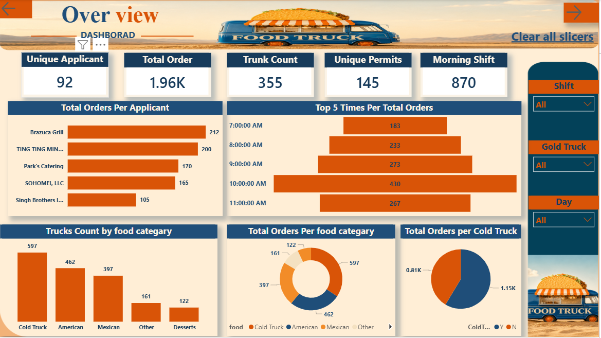
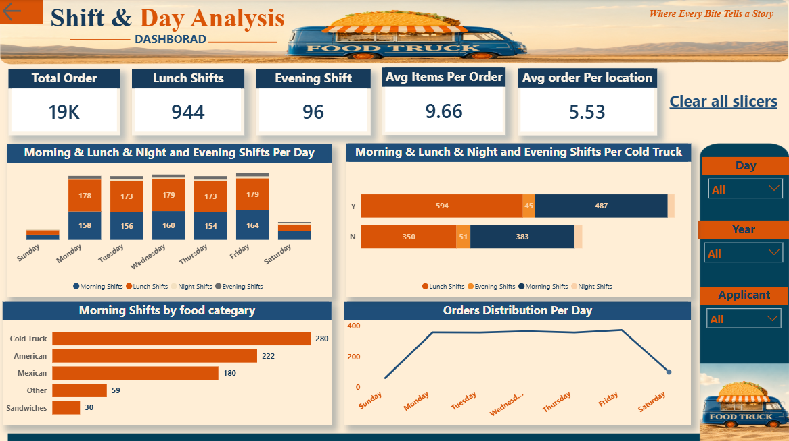
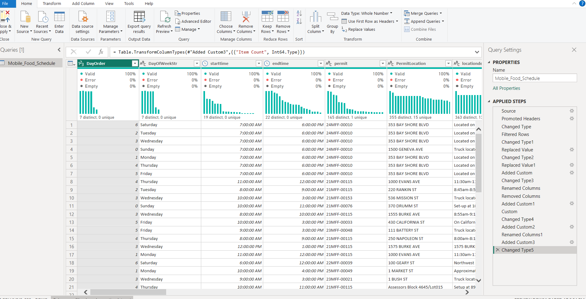

#  Food Truck Dashboard

##  Project Overview

The **Food Truck Dashboard** is an interactive Power BI project designed to analyze food truck operations, customer orders, shift performance, and food categories.
The dashboard provides clear insights into order distribution, truck performance, applicant activity, and shift analysis to support data-driven decisions.

---

##  Tools & Technologies

* Power BI
* Power Query
* DAX
* Data Visualization

---

##  Dashboard Features

### 🔹 Overview Dashboard

* Total Orders Analysis
* Unique Applicants & Permits
* Morning Shift Performance
* Top Applicants by Orders
* Food Category Distribution
* Cold Truck Order Analysis

### 🔹 Shift & Day Analysis

* Morning, Lunch, Evening & Night Shift Analysis
* Orders Distribution Per Day
* Average Items Per Order
* Average Orders Per Location
* Shift Performance by Food Category
* Cold Truck Shift Analysis

---

## 📈 Key Insights

* Identified peak ordering hours and busiest days.
* Analyzed food categories with the highest demand.
* Compared shift performance across different truck types.
* Tracked top applicants based on total orders.

---

##  Dashboard Design

The dashboard was designed using a custom food-truck-themed layout with interactive slicers and clean visual storytelling to improve user experience and readability.

---

## 📂 Project File

https://drive.google.com/file/d/1bIPaRqu0n7_kL6Xq_nDpv0kOXisSs1dI/view?usp=sharing

---

##  How to Use

1. Download the `.pbix` file.
2. Open it using Power BI Desktop.
3. Refresh the data if needed.
4. Explore the interactive dashboard and slicers.

---

##  Dashboard Preview

### Overview Dashboard

### Shift & Day Analysis

### Power Quary

##  Dashboard Demo

https://drive.google.com/file/d/1uH33et55UPj13Gmrcn13EvlBimO-iUjY/view?usp=sharing

---

## 👩‍💻 Author

Created by Rana
